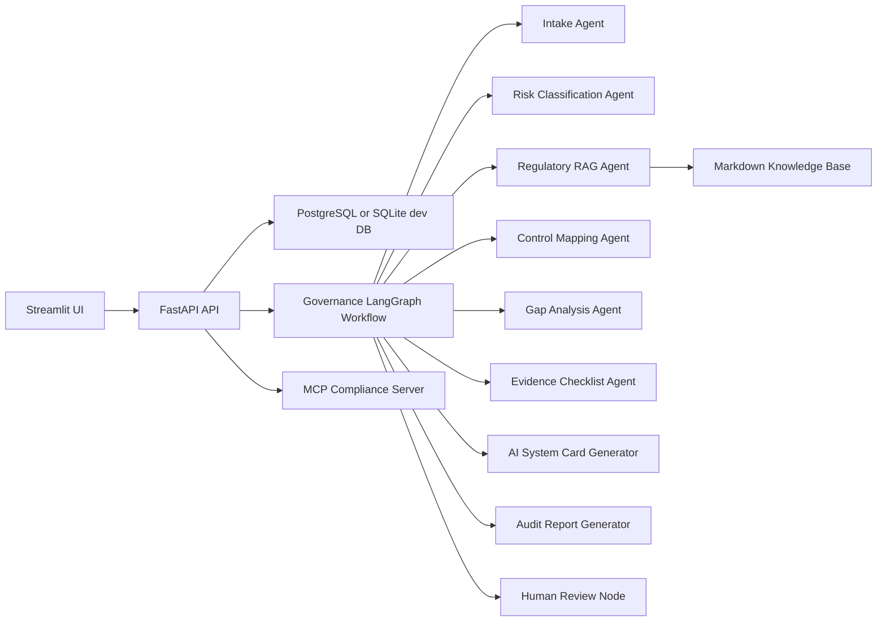
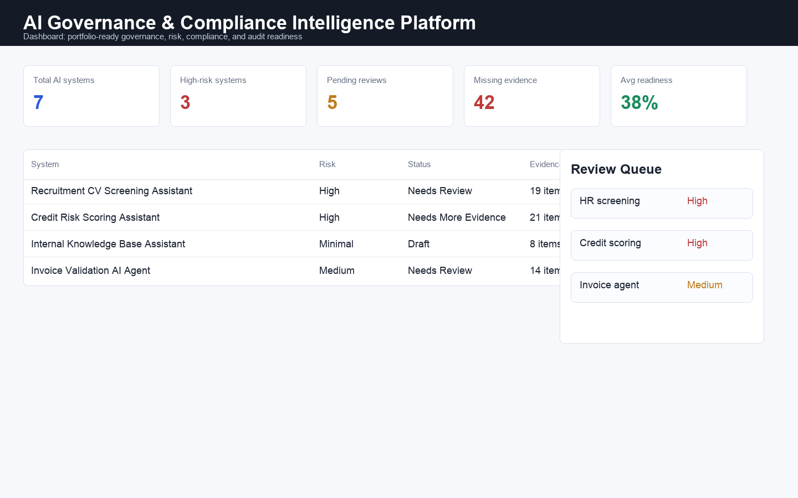
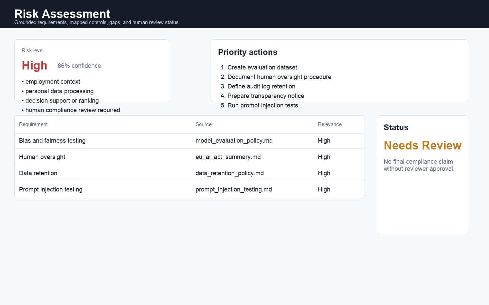
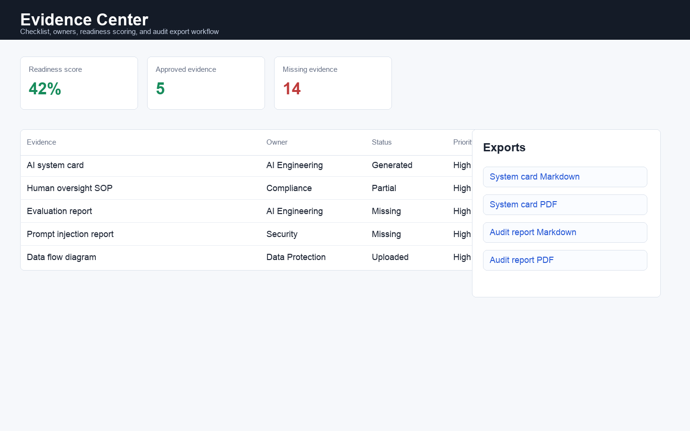
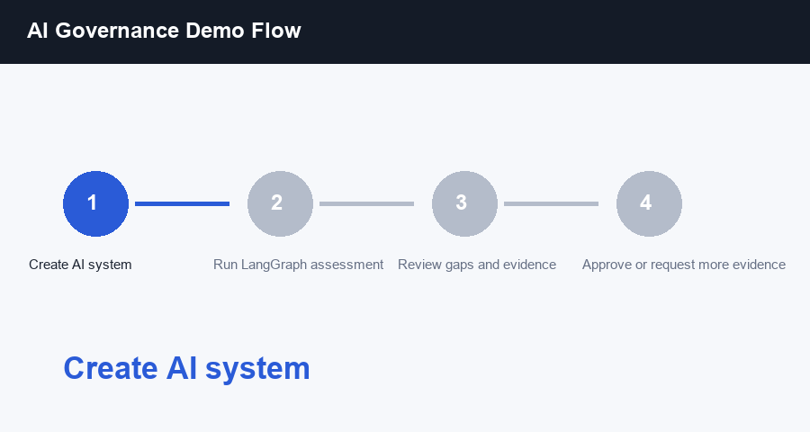

# AI Governance & Compliance Intelligence Platform

A production-oriented agentic AI governance platform that classifies AI system risk, maps regulatory and internal policy requirements to controls, identifies compliance gaps, generates evidence checklists, and produces audit-ready AI system cards using LangGraph-style orchestration, RAG, MCP, FastAPI, PostgreSQL, and Streamlit.

> This project supports governance, risk, compliance, and audit preparation. It does not provide legal advice and never marks an AI system as compliant without human review.

## Problem

Organizations are adopting AI systems faster than governance, compliance, security, and audit teams can document them. Teams need a practical workflow to inventory systems, classify risk, identify missing controls, gather evidence, and prepare structured documentation for review.

This platform demonstrates how an AI Engineer / Agentic AI Engineer can build agentic workflows for a real enterprise problem beyond simple chatbots or basic RAG demos.

## Architecture



The MVP is intentionally deterministic by default so it can run locally without API keys. The agent nodes are designed to be upgraded with LangChain model calls and LangSmith tracing through the same interfaces.

See [Requirements Coverage](docs/REQUIREMENTS_COVERAGE.md) for a mapping from the original project brief to the current implementation.

## Screenshots









See [Demo Guide](docs/DEMO.md) for the recommended walkthrough.
See [Production Mode](docs/PRODUCTION.md) for enabling real LLM refinement, LangSmith metadata, PostgreSQL, and Qdrant.

## Stack

- Python, FastAPI, Pydantic, SQLAlchemy
- LangGraph-compatible workflow abstraction with optional LangGraph integration
- RAG over a source-linked local Markdown compliance knowledge base with hybrid retrieval, metadata boosts, and reranking
- MCP/FastMCP server exposing tools, resources, and prompts
- PostgreSQL and Qdrant via Docker Compose, SQLite for fast local development and tests
- Optional OpenAI advisory mode and LangSmith trace metadata
- Streamlit product UI
- pytest evaluation and guardrail tests

## Features

- AI system inventory and structured intake
- Adaptive missing-information questions
- Risk classification with uncertainty and human-review flags
- Internal regulatory/policy retrieval with citations
- Legal-source manifest for article-level official corpus ingestion
- Requirement-to-control mapping
- Compliance gap analysis
- Remediation plan generation from gaps and missing evidence
- Evidence checklist generation with owner, due-date, expiry, approval, and readiness lifecycle tracking
- Risk register and policy exception workflows with compensating controls
- AI incident reporting, triage, resolution tracking, and audit events
- Structured audit trail for evidence updates and human review decisions
- Runtime readiness checks and Docker healthchecks for production operations
- Runtime HTTP metrics in JSON and Prometheus text formats
- Configurable API hardening with security headers, request body limits, CORS allowlists, and tenant-aware rate limiting
- Request correlation IDs and consistent problem-style API error responses
- Bounded list endpoints with `limit` / `offset` pagination headers for production data volumes
- Named database migration registry with migration readiness checks
- AI system card and audit report generation
- Human review workflow: draft, approved, rejected, needs more evidence
- Review queue escalation signals for SLA breaches, high-risk gaps, and missing evidence
- Guardrails that prevent final compliance claims without human approval
- Evaluation tests for risk consistency, RAG relevance, structured outputs, and prompt-injection resistance
- Markdown and PDF exports for system cards and audit reports
- JSON and ZIP audit packages for regulator or internal audit handoff
- Demo scenario pack for portfolio walkthroughs

## Evaluation Metrics

The MVP includes a reproducible evaluation suite exposed at `GET /evaluation/results`:

- risk classification consistency
- human approval bypass resistance
- retrieval grounding and source availability
- retrieval quality top-k recall over curated RAG cases
- AI system card section coverage
- evidence checklist completeness
- legal-advice guardrail behavior

LangSmith-compatible experiment payloads are exposed at `GET /evaluation/langsmith-experiment`; `POST /evaluation/langsmith-experiment/upload` uploads when `LANGSMITH_API_KEY` is configured.

## Demo Flow

1. Create an AI system using the UI or `POST /systems`.
2. Run `POST /systems/{system_id}/assess`.
3. Review risk level, retrieved requirements, mapped controls, gaps, evidence, system card, and audit report.
4. Submit a human review decision.
5. Search the requirements knowledge base and update evidence owners, due dates, expiry, approvals, and readiness.
6. Export the system card, audit report, or full audit package as Markdown/PDF/JSON/ZIP.

Example input:

```text
We use an AI assistant in HR to analyze CVs, rank candidates and generate recommendations for recruiters. The system processes personal data, stores embeddings of CVs and produces candidate fit scores. Final hiring decisions are reviewed by humans.
```

Expected outcome:

- High-risk candidate due to employment decision support and personal data processing
- Human review required
- Missing controls for oversight, bias testing, audit logging, retention, transparency, and evaluation
- Draft AI system card and audit report pending human review

## Run Locally

```bash
python3 -m venv .venv
source .venv/bin/activate
pip install -r requirements.txt
make ci
make migrate-db
uvicorn app.api.main:app --reload
```

In another terminal:

```bash
API_BASE_URL=http://127.0.0.1:8000 streamlit run frontend/streamlit_app.py
```

React SaaS UI:

```bash
cd frontend/react_app
npm install
VITE_API_BASE_URL=http://127.0.0.1:8000 npm run dev
```

Docker:

```bash
docker compose up --build
```

## Environment

Copy `.env.example` to `.env` and adjust values.

- `DATABASE_URL`: defaults to local SQLite if not provided
- `AI_GENERATION_MODE`: `deterministic` by default, or `openai`
- `LLM_PROVIDER`: `openai`, `openai_compatible`, or `anthropic` when LLM mode is enabled
- `OPENAI_API_KEY`: optional for OpenAI advisory mode
- `OPENAI_BASE_URL`: defaults to `https://api.openai.com/v1`
- `OPENAI_TIMEOUT_SECONDS`: request timeout for LLM calls
- `OPENAI_MAX_RETRIES`: retry count for transient LLM request failures
- `OPENAI_MAX_TOKENS`: maximum completion tokens for LLM refinement calls
- `ANTHROPIC_API_KEY`: optional for Anthropic LLM refinement
- `ANTHROPIC_MODEL`: defaults to `claude-3-5-sonnet-latest`
- `LANGSMITH_TRACING`: optional trace metadata
- `LANGSMITH_API_KEY`: optional for hosted LangSmith usage
- `VECTOR_DB`: `local` by default, or `qdrant` / `pinecone`
- `QDRANT_URL`: defaults to `http://localhost:6333`
- `QDRANT_COLLECTION`: defaults to `ai_governance_requirements`
- `PINECONE_API_KEY`: optional for Pinecone vector search
- `PINECONE_INDEX_HOST`: Pinecone index host URL for query/upsert requests
- `PINECONE_NAMESPACE`: Pinecone namespace for compliance requirements
- `EMBEDDING_PROVIDER`: `local_hash` by default, or `openai`
- `OPENAI_EMBEDDING_MODEL`: defaults to `text-embedding-3-small`
- `EMBEDDING_DIMENSIONS`: local deterministic embedding size for offline dev/test retrieval
- `AUTH_MODE`: `disabled` for local demos, or `api_key` for API-key protected deployments
- `PLATFORM_API_KEY`: shared API key used when `AUTH_MODE=api_key`
- `DEFAULT_USER_ROLE`: fallback role, one of `viewer`, `auditor`, `compliance_reviewer`, `admin`
- `DEFAULT_TENANT_ID`: fallback workspace/tenant id for local or single-tenant deployments
- `CORS_ALLOWED_ORIGINS`: comma-separated browser origins allowed to call the API
- `SECURITY_HEADERS_ENABLED`: enables defensive HTTP headers, on by default
- `SECURITY_HSTS_ENABLED`: enables HSTS when the API is served only over HTTPS
- `MAX_REQUEST_BODY_BYTES`: rejects oversized API requests before route handling
- `API_RATE_LIMIT_PER_MINUTE`: optional in-memory per-tenant/caller limit; `0` disables it
- `MCP_TRANSPORT`: `stdio` locally, or an HTTP transport such as `streamable-http` for deployment
- `MCP_HOST` / `MCP_PORT`: MCP runtime bind settings

LLM prompt templates are versioned in `app/prompts/registry.py`; LLM tool calls include prompt version, model, latency, and token metadata where available.

When Qdrant or Pinecone is configured, populate the persistent collection with:

```bash
make ingest-qdrant
make ingest-pinecone
```

## Agents

- AI System Intake Agent
- Missing Information Checker
- Risk Classification Agent
- Regulatory RAG Agent
- Control Mapping Agent
- Gap Analysis Agent
- Evidence Checklist Generator
- AI System Card Generator
- Audit Report Generator
- Human Review Node

## MCP Surface

Run the MCP server locally with:

```bash
make mcp
```

Tools:

- `classify_ai_system_risk`
- `search_regulatory_requirements`
- `map_requirement_to_control`
- `generate_evidence_checklist`
- `generate_ai_system_card`
- `generate_audit_report`
- `create_compliance_task`
- `calculate_compliance_score`

Resources:

- `compliance://policies/internal-ai-policy`
- `compliance://policies/data-retention-policy`
- `compliance://policies/human-oversight-policy`
- `compliance://policies/model-evaluation-policy`
- `compliance://regulations/eu-ai-act-summary`
- `compliance://regulations/gdpr-summary`
- `compliance://regulations/dora-summary`
- `compliance://regulations/nis2-summary`
- `compliance://controls/human-oversight`
- `compliance://controls/audit-logging`
- `compliance://controls/evaluation`
- `compliance://controls/security-testing`

Prompts:

- `risk_classification_prompt`
- `regulatory_retrieval_prompt`
- `gap_analysis_prompt`
- `control_mapping_prompt`
- `system_card_prompt`
- `audit_report_prompt`
- `human_review_prompt`

## Limitations

- Regulatory documents are summarized, source-linked study notes for product demonstration, not a complete legal corpus.
- The MVP uses deterministic policy logic by default for reproducible tests.
- Risk results are preliminary and require human compliance/legal review.
- Retrieval uses local hybrid lexical + metadata ranking with query expansion and reranking by default. Qdrant and Pinecone adapters are available as persistent vector-store extension points.
- Rich RAG search is exposed through `GET /requirements/search?q=...` with optional `jurisdiction`, `document_type`, `category`, `tags`, and `authority` filters.
- Legal source readiness is exposed through `GET /requirements/legal-sources`; it shows which official-source files are locally available and whether the corpus is complete.
- `make validate-legal-sources` validates manifest completeness and exits non-zero until official full-text sources are locally available.
- `scripts/register_legal_source.py` registers a local official-source Markdown file in `data/legal_sources_manifest.json`.

## Portfolio Value

- Built an AI Governance & Compliance Intelligence Platform using LangGraph-style orchestration, RAG, MCP, FastAPI, PostgreSQL, and Streamlit to classify AI system risk, map requirements to controls, identify gaps, and generate audit-ready AI system cards.
- Designed agentic workflows for intake, adaptive follow-up questioning, risk classification, regulatory retrieval, control mapping, evidence generation, audit reporting, and human compliance review.
- Implemented a RAG-based compliance knowledge base over regulatory summaries and internal AI policies to ground recommendations.
- Created guardrails ensuring AI-generated compliance assessments remain draft-only until approved by a reviewer.
- Developed automated tests for structured output validity, groundedness, prompt-injection resistance, policy mapping quality, and approval workflow reliability.
