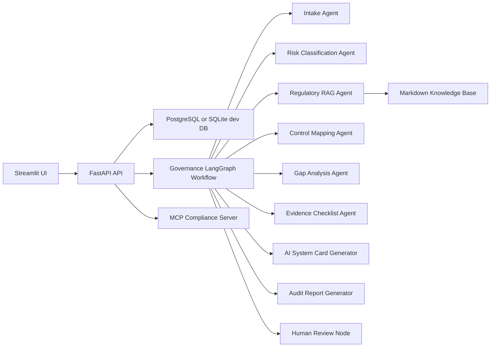

# AI Governance & Compliance Intelligence Platform

A production-oriented agentic AI governance platform that classifies AI system risk, maps regulatory and internal policy requirements to controls, identifies compliance gaps, generates evidence checklists, and produces audit-ready AI system cards using LangGraph-style orchestration, RAG, MCP, FastAPI, PostgreSQL, and Streamlit.

> This project supports governance, risk, compliance, and audit preparation. It does not provide legal advice and never marks an AI system as compliant without human review.

## Problem

Organizations are adopting AI systems faster than governance, compliance, security, and audit teams can document them. Teams need a practical workflow to inventory systems, classify risk, identify missing controls, gather evidence, and prepare structured documentation for review.

This platform demonstrates how an AI Engineer / Agentic AI Engineer can build agentic workflows for a real enterprise problem beyond simple chatbots or basic RAG demos.

## Architecture



The MVP is intentionally deterministic by default so it can run locally without API keys. The agent nodes are designed to be upgraded with LangChain model calls and LangSmith tracing through the same interfaces.

See [Requirements Coverage](docs/REQUIREMENTS_COVERAGE.md) for a mapping from the original project brief to the current implementation.

## Stack

- Python, FastAPI, Pydantic, SQLAlchemy
- LangGraph-compatible workflow abstraction with optional LangGraph integration
- RAG over local Markdown compliance knowledge base
- MCP/FastMCP server exposing tools, resources, and prompts
- PostgreSQL via Docker Compose, SQLite for fast local development and tests
- Streamlit product UI
- pytest evaluation and guardrail tests

## Features

- AI system inventory and structured intake
- Adaptive missing-information questions
- Risk classification with uncertainty and human-review flags
- Internal regulatory/policy retrieval with citations
- Requirement-to-control mapping
- Compliance gap analysis
- Evidence checklist generation
- AI system card and audit report generation
- Human review workflow: draft, approved, rejected, needs more evidence
- Guardrails that prevent final compliance claims without human approval
- Evaluation tests for risk consistency, RAG relevance, structured outputs, and prompt-injection resistance

## Evaluation Metrics

The MVP includes a reproducible evaluation suite exposed at `GET /evaluation/results`:

- risk classification consistency
- human approval bypass resistance
- retrieval grounding and source availability
- AI system card section coverage
- evidence checklist completeness
- legal-advice guardrail behavior

## Demo Flow

1. Create an AI system using the UI or `POST /systems`.
2. Run `POST /systems/{system_id}/assess`.
3. Review risk level, retrieved requirements, mapped controls, gaps, evidence, system card, and audit report.
4. Submit a human review decision.
5. Search the requirements knowledge base and update evidence readiness.

Example input:

```text
We use an AI assistant in HR to analyze CVs, rank candidates and generate recommendations for recruiters. The system processes personal data, stores embeddings of CVs and produces candidate fit scores. Final hiring decisions are reviewed by humans.
```

Expected outcome:

- High-risk candidate due to employment decision support and personal data processing
- Human review required
- Missing controls for oversight, bias testing, audit logging, retention, transparency, and evaluation
- Draft AI system card and audit report pending human review

## Run Locally

```bash
python3 -m venv .venv
source .venv/bin/activate
pip install -r requirements.txt
uvicorn app.api.main:app --reload
```

In another terminal:

```bash
API_BASE_URL=http://127.0.0.1:8000 streamlit run frontend/streamlit_app.py
```

Docker:

```bash
docker compose up --build
```

## Environment

Copy `.env.example` to `.env` and adjust values.

- `DATABASE_URL`: defaults to local SQLite if not provided
- `LANGSMITH_TRACING`: optional
- `LANGSMITH_API_KEY`: optional
- `VECTOR_DB`: `local` in the MVP

## Agents

- AI System Intake Agent
- Missing Information Checker
- Risk Classification Agent
- Regulatory RAG Agent
- Control Mapping Agent
- Gap Analysis Agent
- Evidence Checklist Generator
- AI System Card Generator
- Audit Report Generator
- Human Review Node

## MCP Surface

Tools:

- `classify_ai_system_risk`
- `search_regulatory_requirements`
- `map_requirement_to_control`
- `generate_evidence_checklist`
- `generate_ai_system_card`
- `generate_audit_report`
- `create_compliance_task`
- `calculate_compliance_score`

Resources:

- `compliance://policies/internal-ai-policy`
- `compliance://policies/data-retention-policy`
- `compliance://policies/human-oversight-policy`
- `compliance://policies/model-evaluation-policy`
- `compliance://regulations/eu-ai-act-summary`
- `compliance://regulations/gdpr-summary`
- `compliance://regulations/dora-summary`
- `compliance://regulations/nis2-summary`
- `compliance://controls/human-oversight`
- `compliance://controls/audit-logging`
- `compliance://controls/evaluation`
- `compliance://controls/security-testing`

Prompts:

- `risk_classification_prompt`
- `regulatory_retrieval_prompt`
- `gap_analysis_prompt`
- `control_mapping_prompt`
- `system_card_prompt`
- `audit_report_prompt`
- `human_review_prompt`

## Limitations

- Regulatory documents are summarized internal demo documents, not full legal sources.
- The MVP uses deterministic policy logic by default for reproducible tests.
- Risk results are preliminary and require human compliance/legal review.
- Vector search uses local lexical retrieval in the MVP; Qdrant/Pinecone can be added in later milestones.

## Portfolio Value

- Built an AI Governance & Compliance Intelligence Platform using LangGraph-style orchestration, RAG, MCP, FastAPI, PostgreSQL, and Streamlit to classify AI system risk, map requirements to controls, identify gaps, and generate audit-ready AI system cards.
- Designed agentic workflows for intake, adaptive follow-up questioning, risk classification, regulatory retrieval, control mapping, evidence generation, audit reporting, and human compliance review.
- Implemented a RAG-based compliance knowledge base over regulatory summaries and internal AI policies to ground recommendations.
- Created guardrails ensuring AI-generated compliance assessments remain draft-only until approved by a reviewer.
- Developed automated tests for structured output validity, groundedness, prompt-injection resistance, policy mapping quality, and approval workflow reliability.
