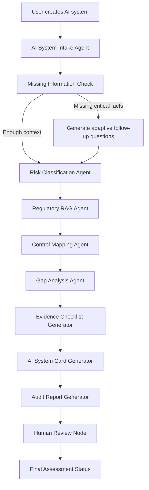

# Architecture

## Product Boundary

The platform is an AI governance and audit-readiness assistant. It helps teams prepare structured analysis, evidence, and documentation, but it does not replace legal, compliance, security, or data-protection review.

## Core LangGraph Workflow

## Refined Architecture

- `app/api`: HTTP API and route boundaries.
- `app/agents`: workflow state, graph assembly, and deterministic node implementations.
- `app/rag`: local document loading, metadata-aware chunking, hybrid retrieval, and reranking.
- `app/mcp_server`: reusable compliance tools, resources, and prompts exposed for agents.
- `app/database`: SQLAlchemy models, session lifecycle, and repositories.
- `app/schemas`: Pydantic contracts for API, agents, and persistence.
- `app/services`: orchestration layer that joins repositories and agent workflows.
- `frontend`: Streamlit UI for product workflow.
- `data`: summarized regulations, policies, controls, and sample systems.
- `tests`: unit, API, guardrail, and evaluation tests.

Evidence records operate as lifecycle items, not just checklist text. Each item can track owner, status, due date, expiry date, approval metadata, review notes, and readiness impact.

API access control is handled by lightweight RBAC dependencies. Local demos use disabled auth, while production deployments can require API-key authentication and role headers for viewer, auditor, compliance reviewer, and admin access.
Tenant context is carried through the same auth dependency. Core workflow data is scoped by tenant so users only list or retrieve systems, assessments, evidence, reports, reviews, and audit events from their own workspace.

Human review and evidence changes emit structured audit events. Audit events include actor, actor role, action, resource type, resource id, assessment id, details, and timestamp so governance actions can be reconstructed later.

## LangGraph State Management

The workflow is compiled with `langgraph.graph.StateGraph` in [app/agents/graph.py](/Users/gdev/Documents/Codex/2026-06-08/files-mentioned-by-the-user-pasted-3/app/agents/graph.py). Each node receives and returns `GovernanceAssessmentState`, which keeps the complete assessment trace:

- raw intake text and adaptive follow-up questions
- structured system profile
- preliminary risk classification
- retrieved policy and regulation requirements
- mapped controls, gap analysis, and evidence checklist
- generated system card and audit report
- human-review status, tool calls, and errors

The MVP graph is linear for auditability. Later milestones can add conditional edges for missing-information loops, reviewer escalation, and MCP-backed tool execution.

## Human Review Principle

The graph always ends in a human-review state. A generated assessment can be `draft` or `needs_review`, but only an explicit reviewer action can set it to `approved`.

## RAG Principle

Recommendations should reference retrieved internal policy or regulation summaries. The local RAG path uses Markdown documents enriched with jurisdiction, authority, source URL, document type, effective date, tags, and citation labels. Retrieval combines lexical overlap, phrase matching, metadata boosts, optional Qdrant vector scores, and reranking with a score breakdown. Qdrant can be populated through `make ingest-qdrant` and stores the same citation-rich payload used by the local fallback.

## Observability

Agent runs and tool calls are logged to the database. LangSmith tracing can be enabled through environment variables in later integrations.
